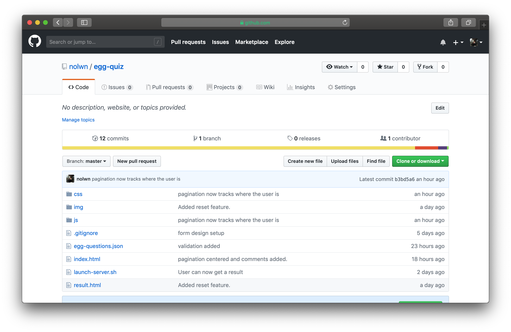
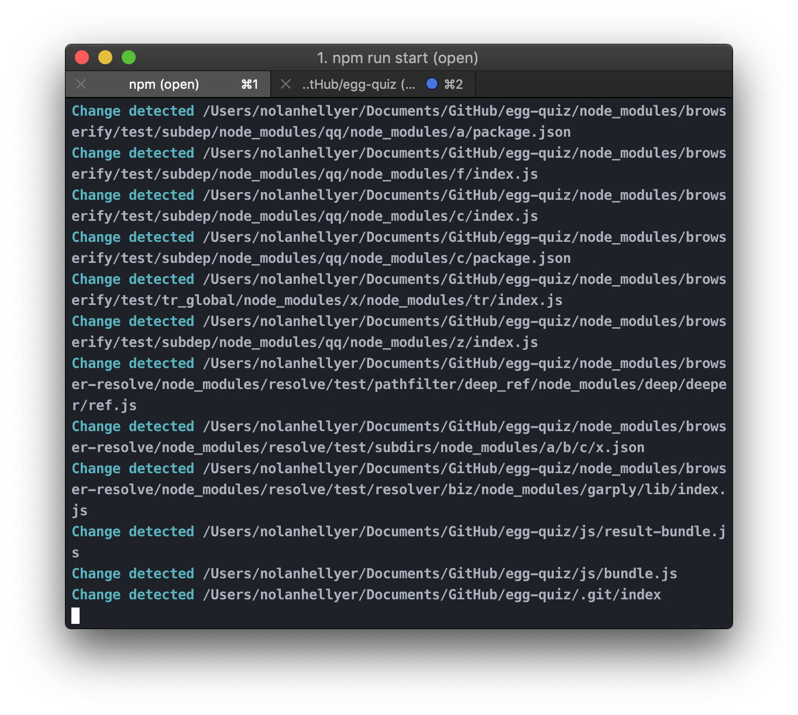
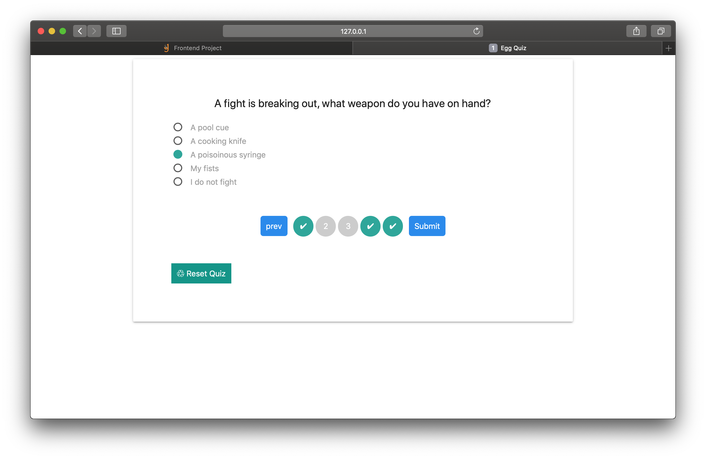

# Egg Quiz

The egg quiz is a personality quiz which matches your personality to an egg preparation.

## Getting Started

### Prerequisites

This project uses Node npm, you will need to install that before proceeding with the installation instruction below

https://nodejs.org/en/download/

#### With Homebrew

`brew install node`

### Installation

The installation instructions describe installing the package so that you can make your own changes to it.

1. Fork the repository from GitHub: https://github.com/nolwn/egg-quiz.git
2. Clone egg-quiz onto your machine
3. In the egg-quiz directory, run `npm init`
4. Now, `npm install` to install the developer dependencies

5. Run `npm run start` to launch the development server with browserify, watchify and brfs active.

## Roadmap

Future features in no particular order:

* Add the ability to jump to a question via the pagination at the bottom
* Add more questions, balance the outcomes better
* Add more types of question, current only supports "multi-choice"
* Remove static HTML buttons and generate them through JavaScript

## Huge Future Feature
* Make a general version of the quiz—not just egg silliness—where users can create their own quizes and same them to the server
